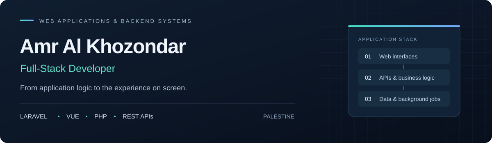

  

  <strong>Web platforms · Backend systems · Mobile applications</strong> 
  Gaza, Palestine  
  <a href="https://www.linkedin.com/in/amr-al-khozondar-412282374/"><strong>LinkedIn ↗</strong></a> &nbsp; · &nbsp;
  <a href="https://github.com/zxSHOXxz">GitHub ↗</a>

  <a href="#about">About</a> &nbsp; / &nbsp;
  <a href="#technical-stack">Technical stack</a> &nbsp; / &nbsp;
  <a href="#selected-project-work">Project work</a> &nbsp; / &nbsp;
  <a href="#engineering-approach">Engineering approach</a> &nbsp; / &nbsp;
  <a href="#connect">Connect</a>

---

## About

I'm **Amr Al Khozondar**, a full-stack developer from Palestine. My work spans Laravel backends, Vue and React interfaces, and Flutter mobile applications, with a focus on software that supports real operational workflows.

I work across **medical education, conference management, and digital healthcare** — domains where scheduling, permissions, reporting, and a clear user experience need to fit together. My work includes developing features, integrating APIs, investigating defects, and improving existing applications.

My strongest focus is **PHP and Laravel**, supported by hands-on work across the frontend and mobile layers. I care about how a feature behaves as a whole: the data it changes, who can access it, what the user sees, and how it handles failure.

## Technical stack

| Area | Technologies I work with |
| :--- | :--- |
| **Backend** | PHP · Laravel · REST APIs · Eloquent ORM · Sanctum |
| **Frontend** | JavaScript · TypeScript · Vue.js · React · Next.js · Inertia.js |
| **Interface development** | HTML · CSS · Tailwind CSS · Vuetify · Responsive layouts |
| **Mobile** | Dart · Flutter · API integration |
| **Data & background processing** | MySQL · PostgreSQL · Redis · Laravel Queues · Horizon |
| **Application architecture** | Multi-tenancy · Modular applications · Role-based permissions |
| **Testing & code quality** | Pest · PHPUnit · PHPStan / Larastan · ESLint |
| **Development & delivery** | Git · GitHub · Docker · Vite · GitHub Actions |

## Selected project work

### Medlet · Medical education

Work across a platform supporting medical training and academic administration, with a **Laravel backend and a Next.js / React frontend**.

- Evaluation workflows, assessment statistics, and training logbooks.
- Administrative interfaces and reporting for education workflows.
- Multi-tenant application behavior and role-based access.
- Background processing, data lifecycle workflows, and application maintenance.

**Engineering focus:** keeping evaluation logic, permissions, and the interface consistent across connected features.

### Sparcly · Conference management

Work across conference operations using **Laravel and Vue.js**, connecting administrative tools with participant-facing experiences.

- Conference programs, session schedules, and timezone handling.
- Registration and recruitment workflows.
- Badge and certificate generation, including their editing interfaces.
- API integration, interface refinements, and feature verification.

**Engineering focus:** translating event operations into clear workflows, with careful handling of scheduling and generated documents.

### Tabib · Digital healthcare

Work across a healthcare application with a **Laravel backend, Vue.js web interfaces, and a Flutter mobile app**.

- Appointment booking and scheduling flows.
- Video consultation and communication experiences.
- Medical record and prescription workflows.
- Arabic-first mobile experiences and integration with backend APIs.

**Engineering focus:** coordinating web, mobile, and backend behavior throughout the appointment and consultation journey.

These summaries describe the general scope of my work. Project source repositories are private.

## Engineering approach

**Understand the workflow.** Start with the people using the feature, the decisions they need to make, and the rules the software must enforce.

**Connect the whole feature.** Consider validation, authorization, database changes, API responses, and interface states together.

**Account for real conditions.** Give attention to timezones, background jobs, interrupted requests, and the edge cases that appear outside the happy path.

**Verify meaningful behavior.** Use focused tests, static analysis, and interface checks to validate changes and catch regressions.

**Keep maintenance practical.** Prefer clear responsibilities, consistent patterns, and changes that other developers can follow.

## Connect

For professional conversations about web platforms, Laravel development, or mobile applications, connect with me on **[LinkedIn](https://www.linkedin.com/in/amr-al-khozondar-412282374/)**.

---

  <strong>Amr Al Khozondar</strong> 
  Full-stack development · Palestine

